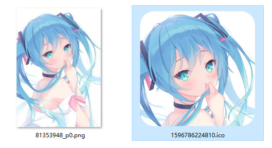

[简体中文](./Readme.md) | [English](./Readme-en.md)

# Introduction

This is a tool for converting image into icon files, which can be directly converted locally without uploading image to a remote server.

It is written in JavaScript and is suitable for use in a browser. Need to run in http(s) protocol. 

[Online use](https://icon.pixiv.download/index-en.html)

# Effect



# Instructions

1. Include `imageToIcon.js` or `imageToIcon.ts`.

>`imageToIcon.js/ts` is a ES 6 module that exports `{ img2ico }`.

2. Use `img2ico.convert()` to convert.

## Parameter Description

`img2ico.convert()` is an asynchronous function, and its parameter is an Object:

```javascript
{
  source: string | File
  size: SizeNumber[]
  shape:'square' |'circle' |'fillet'
  bleed: boolean
}

// Type declaration:
type SizeNumber = 16 | 32 | 48 | 96 | 128 | 256 | 512
```

-`source` The url of the image, or a image file. (If image url is used, please pay attention to the impact of cross-domain policy)
-`size` size, multiple sizes can be used at the same time. You can also use custom sizes.
-`shape` shapes: square, circle, rounded square
-`bleed` blank-leaving, only effective when the shape is rounded rectangle, can make some white space around the picture.

## Output

After the conversion is successful, the Blob object of the icon file is returned.

```javascript
const blob = await img2ico.convert(arg)
```

This tool will not download files. You can use `URL.createObjectURL(blob)` to generate the URL of the file and download it yourself.

## other instructions

1. The generated icon is always square (length and width are equal). If the length and width of the picture are not equal, the narrow side will be used as the benchmark, and a square will be cropped from the narrow side.

2. The generated icon can contain icons of various sizes. The icons are all 32-bit png image.